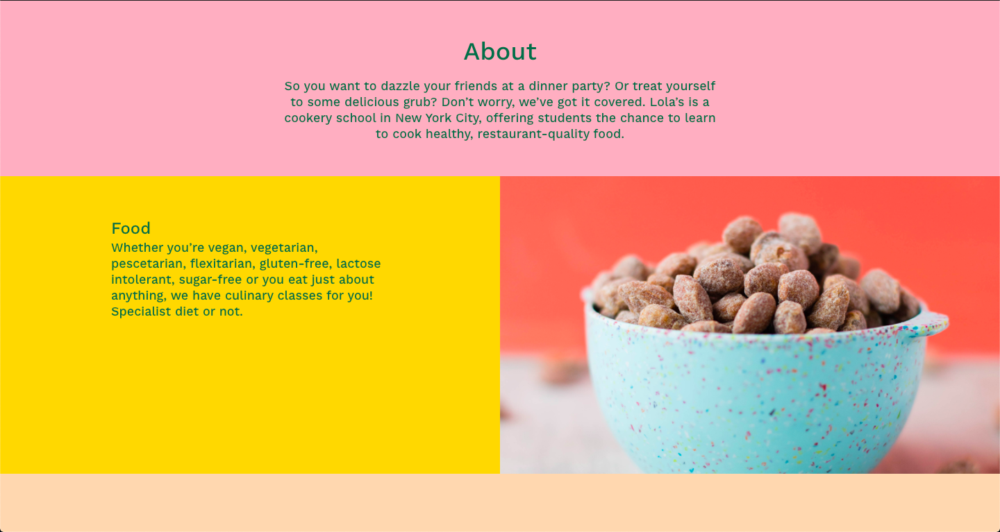

# Lolas
Responsive multi-column site for a cookery school.
## Table of contents
* [General info](#general-info)
* [Screenshots](#screenshots)
* [Technologies](#technologies)
* [Demo](#demo)
* [Features](#features)
* [Status](#status)
* [Inspiration](#inspiration)
* [Contact](#contact)

## General info
This was the third homework project on the [Superhi Foundation](https://superhi.com/courses/html-css-javascript-foundation) course. The project is based on the main project of the week, [Furneaux's](https://github.com/guybroadhurst/furneauxs/). It was designed by Meara Withe for a cookery school in New York.

## Screenshots

## Technologies
* HTML5 
* CSS3

## Demo
[Live Demo](https://guybroadhurst.github.io/lolas/)

## Features
List of features:
* Fixed header that stays at the top of the viewport when you scroll.
* Multiple column layout.
* Elements with different levels of opacity.

## Status
Project is: _finished_ and complete for the course.

## Inspiration
Designed by Meara Withe, [Website](http://www.mearawithe.co/) [Twitter](https://twitter.com/mearawithe)
 
## Contact
Created by [@guybroadhurst](https://www.guybroadhurst.co.uk/) - feel free to contact me!